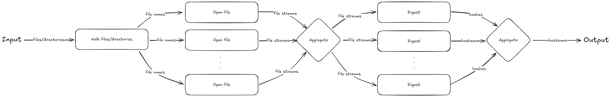

<div align="center">
  <h1>
    summer
    <br />
    <a href="https://github.com/utilyre/summer/releases/latest">
      
    </a>
    <a href="https://go.dev">
      
    </a>
    <a href="https://github.com/utilyre/summer/issues">
      
    </a>
    <a href="https://github.com/utilyre/summer/actions/workflows/ci.yaml">
      
    </a>
  </h1>
  <p>
    High-performance utility for generating checksums in parallel, capable of
    handling a 5GB database in less than 2 seconds.
  </p>
</div>

## Installation

- [Latest Release](https://github.com/utilyre/summer/releases/latest)

- Manual

  ```bash
  go install github.com/utilyre/summer/cmd/summer@latest
  ```

## Usage

For starters, you can run the `generate` command on any file:

```
$ summer generate foo bar
764efa883dda1e11db47671c4a3bbd9e  foo
081ecc5e6dd6ba0d150fc4bc0e62ec50  bar
```

Add the `-r` flag to generate checksums for directories recursively:

```
$ summer generate -r bar nested
081ecc5e6dd6ba0d150fc4bc0e62ec50  bar
168065a0236e2e64c9c6cdd086c55f63  nested/baz
```

To utilize more cores of your CPU, pass `--open-file-jobs=n` and
`--digest-jobs=m` flags, where `n` and `m` are the number of jobs used for each
task respectively.

Run `summer help generate` to learn more about different flags.

## API

It is possible to call the API of this utility directly in your own
application. Here's an example:

```go
package main

import (
	"context"
	"log"

	"github.com/utilyre/summer/pkg/summer"
)

func main() {
	s, err := summer.New()
	if err != nil {
		log.Fatal(err)
	}

	checksums, err := s.Sum(context.TODO(), "foo", "bar")
	if err != nil {
		log.Fatal(err)
	}

	for cs := range checksums {
		if cs.Err != nil {
			log.Println(result.Err)
			continue
		}

		// use cs
	}
}
```

For more information visit the [Documentation][docs].

[docs]: https://pkg.go.dev/github.com/utilyre/summer

## How It Works

This CLI tool efficiently calculates checksums by processing files in parallel
using a multi-stage pipeline. The pipeline architecture allows different tasks
to be processed concurrently, optimizing performance. The process consists of
the following stages:

1. **Walk:** The tool recursively scans the given files and
   directories, identifying all regular files. Each discovered file name is
   then passed to the next stage.

2. **Open File:** The file names are used to open the corresponding files,
   producing data streams for their contents. These streams are then sent to
   the next stage.

3. **Digest:** Each data stream is processed to compute its hash.

Finally, all the calculated hashes are aggregated and streamed as checksums.

The [`pipeline`][pipeline] package handles data flow and parallel execution,
ensuring efficient processing. The Data Flow Diagram (DFD) below visually
represents the process:



By leveraging this pipeline-based approach, the tool efficiently computes
checksums for large sets of files with minimal overhead.

[pipeline]: https://pkg.go.dev/github.com/utilyre/summer/pkg/pipeline

## License

This project is licensed under the [Apache License 2.0][license]. You are free
to use, modify, and distribute it under the terms of this license.

[license]: https://www.apache.org/licenses/LICENSE-2.0
